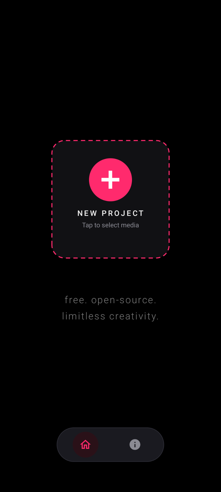
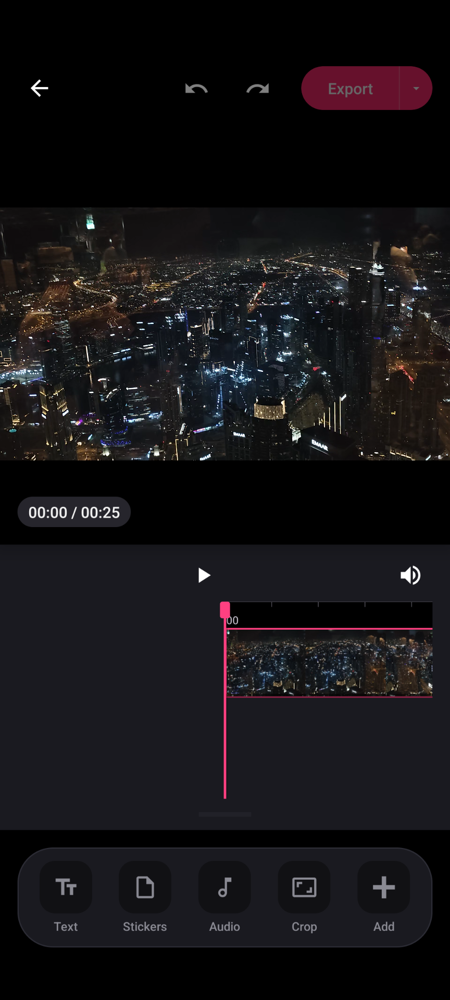
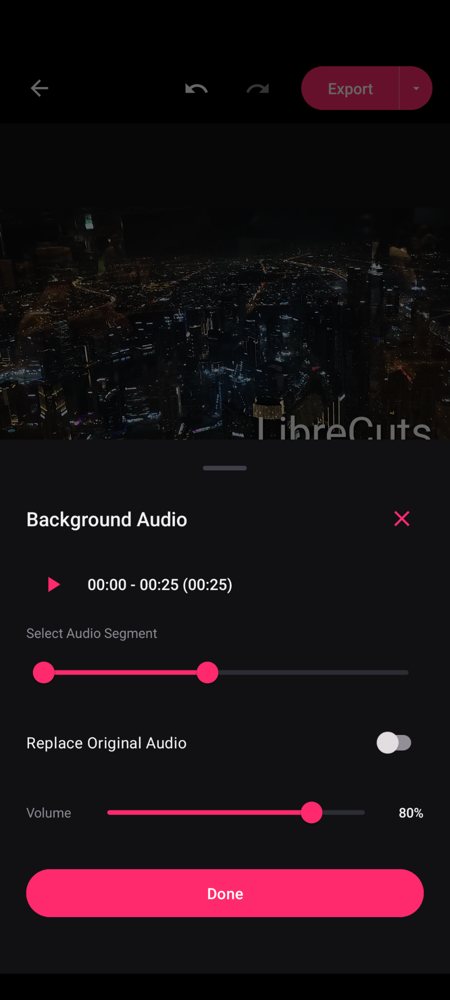
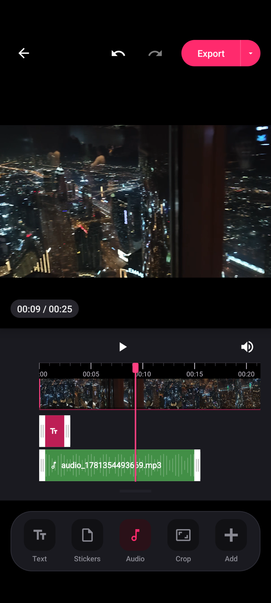

# LibreCuts

<div align="center">
  
  <br/>
  <br/>

  <a href="https://github.com/sponsors/tharunbirla">
    
  </a>
  <a href="LICENSE">
    
  </a>
</div>

<br/>

**LibreCuts** is a free, open-source video editor for Android that prioritizes simplicity, efficiency, and privacy. Built for seamless performance, it empowers creators to easily select, edit, and export watermark-free videos locally on their device.

---

## 🚀 Features

- **Trim** - Remove unwanted parts from the beginning or end of a video clip with a real-time timeline control.
- **Overlays** - Place text or images on top of video clips to create engaging content.
- **Audio** - Manage soundtracks effortlessly by importing custom music or audio tracks.
- **Scale** - Adjust the size and positioning of a video or image within the frame.
- **Merge** - Combine multiple video segments into a continuous sequence.
- **Rotate** - Change the orientation of a video clip.

## 📱 Screenshots

<div align="center">
  <table>
    <tr>
      <td align="center"></td>
      <td align="center"></td>
      <td align="center"></td>
      <td align="center"></td>
    </tr>
    <tr>
      <td align="center"><b>Home Screen</b></td>
      <td align="center"><b>Editor Screen</b></td>
      <td align="center"><b>Audio Import</b></td>
      <td align="center"><b>Timeline</b></td>
    </tr>
  </table>
</div>

## 💖 Support LibreCuts

LibreCuts is built with passion and provided to the community for free. If this app has helped you create amazing videos, consider supporting its continued development! Your sponsorship helps keep the project alive and growing.

<div align="center">
  <br/>
  <a href="https://github.com/sponsors/tharunbirla">
    
  </a>
  <br/>
  <br/>
</div>

## 🛠️ Getting Started

### Prerequisites

- Android Studio
- Android SDK

### Installation

1. **Clone the repository**:
   ```bash
   git clone https://github.com/tharunbirla/LibreCuts.git
   ```
2. **Open the project in Android Studio**:
   - Launch Android Studio and select "Open an existing Android Studio project."
   - Navigate to the cloned directory and select it.
3. **Build the project**:
   - Click on "Build" in the menu, then select "Make Project."
4. **Run the app**:
   - Connect an Android device or start an emulator.
   - Click on the "Run" button in Android Studio.

## 🔒 Permissions

LibreCuts requires the following permissions to function properly:

- **READ_EXTERNAL_STORAGE**: To read videos from the device.
- **WRITE_EXTERNAL_STORAGE**: (For older Android versions) To save edited videos.
- **POST_NOTIFICATIONS**: To show notifications related to video editing.
- **READ_MEDIA_AUDIO/VIDEO/IMAGES**: For accessing media files on devices running Android 13 (API level 33) and above.

## 🤝 Contributing

Contributions are welcome! If you have suggestions or improvements, feel free to create a pull request or open an issue.

1. Fork the repository.
2. Create a new branch for your feature or bug fix.
3. Commit your changes.
4. Push to the branch.
5. Submit a pull request.

## 📝 License

This project is licensed under the MIT License. See the [LICENSE](LICENSE) file for details.
